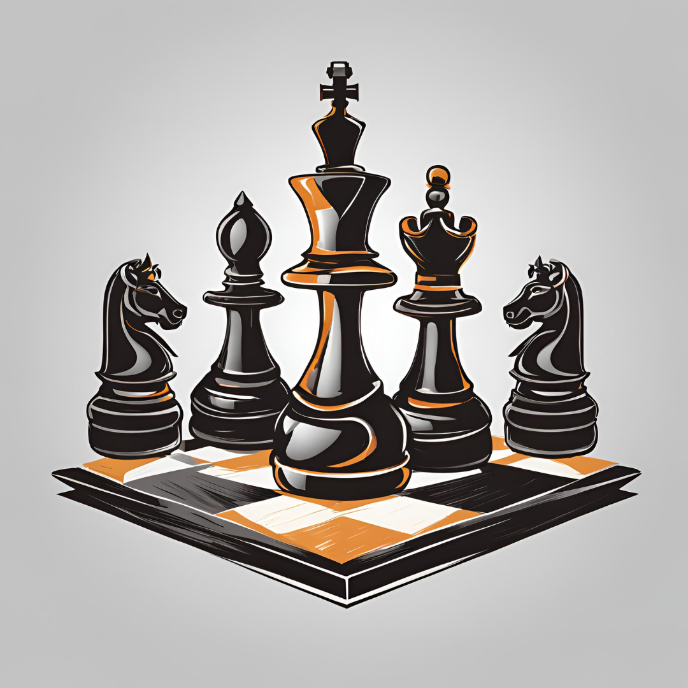

  
  <h1>🎉 Awesome Social Chess 🎉</h1>
  

    
  

  

    
    
    
    
    
    
    
    
    
    
    
    
    
    
    
    
  

## 📚 Table of Contents

- [📖 Books](#books)
- [📅 Calendars](#calendars)
- [🃏 Cards](#cards)

## 📖 Books

| Title                                                                              | Author(s)                                         | Publisher                               |
| ---------------------------------------------------------------------------------- | ------------------------------------------------- | --------------------------------------- |
| **101 Questions On How To Play Chess**                                             | Fred Wilson                                       | Dover Game And Puzzle Activity Books    |
| **Bobby Fischer Teaches Chess**                                                    | Bobby Fischer, Stuart Margulies, Donn Mosenfelder | Basic Systems Inc, Bantam Books         |
| **Chess for Kids**: How to Play and Win                                            | Richard James                                     | Robinson; 2nd edition (2015)            |
| **Chess Openings For Dummies**                                                     | James Eade                                        | For Dummies                             |
| **How Life Imitates Chess**: Life's a Game. Play to Win.                           | Gary Kasparov                                     | Penguin Books (2021)                    |
| **Learn Chess**: A Gold-medal Winner Explains How to Play and Win at Chess         | John Nunn                                         | Gambit Publications Ltd                 |
| **Learn Chess From The Greats**                                                    | Peter J. Tamburro, Jr.                            | Dover Publications                      |
| **Learn To Play Chess Like A Boss**                                                | Patrick Wolff                                     | Penguin Random House Dorling Kindersley |
| **Modern Chess Openings: MC0-15**                                                  | Nick de Firmian                                   | Random House Puzzles and Games          |
| **MY 60 Memorable Games: Chess Tactics, Chess Strategies**                         | Bobby Fischer                                     | Batsford GB                             |
| **My System: Winning Chess Strategies**                                            | Aron Nimzowitsch                                  | SnowBall Publishing                     |
| **The Caro-Kann The Easy Way**                                                     | Thomas Engqvist                                   | Batsford Chess                          |
| **The Chess Player's Bible**: Illustrated Strategies For Staying Ahead Of The Game | Eade & Lawrence                                   | Apple Press A Quarto Book               |
| **The Life and Games of Mikhail Tal**                                              | Everyman Chess Classic                            | Everyman Chess                          |
| **The Usborne Complete Book of Chess**                                             | Elizabeth Dalby                                   | Usborne Publishing Ltd                  |

## 📅 Calendars

- **American Chess Magazine Chess 2024** - A Year of Chess Puzzles

## 🃏 Cards

| Title                                     | Description                                                                          |
| ----------------------------------------- | ------------------------------------------------------------------------------------ |
| **Chess Endgame Cards General: Benoni 1** | Standard size playing cards                                                          |
| **The Chess Deck**                        | 50 Cards For Mastering The Basics - Levy Rozman AKA GOTHAMCHESS: Large deck of cards |
